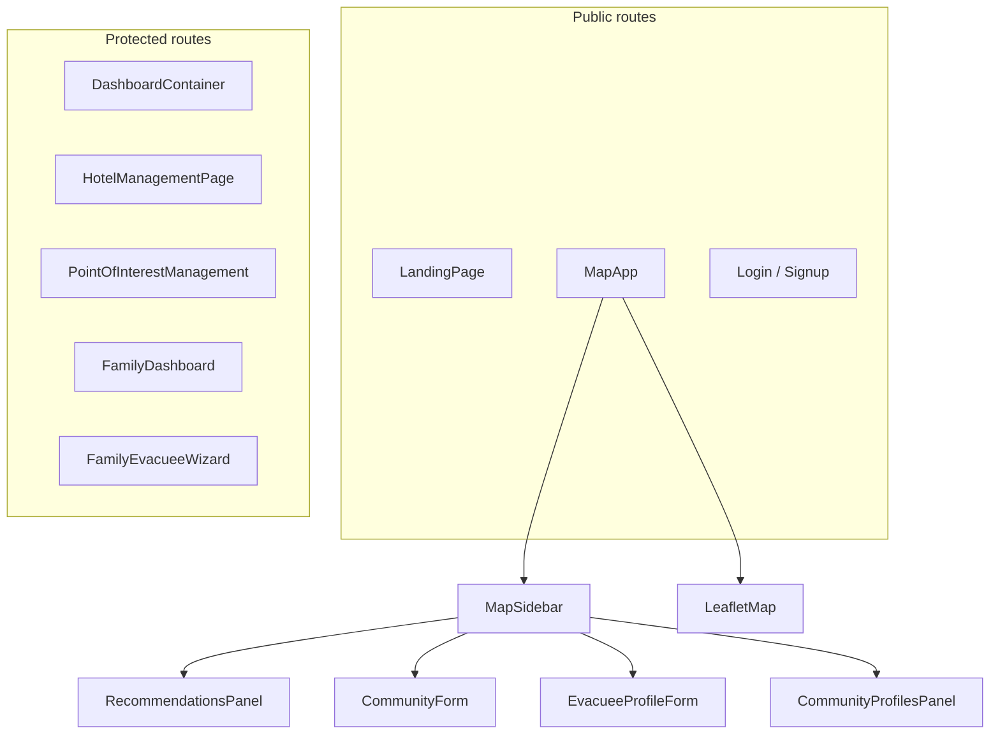

# CityStrata Frontend Refactor – Official Phase Plan

This file is the official execution plan for frontend redesign and phased UI refactor.

All future implementation decisions must align with:

1. .cursorrules
2. Project Skills under .cursor/skills
3. This PHASE_PLAN.md

No implementation should bypass this workflow.

Mandatory process:
Audit → Plan → Approval → Implementation

Do not write code before approval.
Do not perform opportunistic refactors outside approved scope.

## Evidence base (routing and theme)

- **Routes** are defined in `[frontend/src/App.jsx](frontend/src/App.jsx)` (`react-router-dom`).
- **Global theme** is light HSL tokens with purple primary in `[frontend/src/index.css](frontend/src/index.css)` (`--primary: 237 91% 66%`), not the slate-950 / blue-600 stack from `.cursorrules`.
- **Scoped municipality/family styling** uses `[frontend/src/user_dashboard/dashboard.css](frontend/src/user_dashboard/dashboard.css)` (`.dashboard-app`, `.dashboard-app__gradient`, sidebar shell).
- **Map shell** uses hard-coded light grays and white map frame in `[frontend/src/MapApp.tsx](frontend/src/MapApp.tsx)`.
- **Shadcn primitives** live under `[frontend/src/components/ui/](frontend/src/components/ui/)` (14 files: button, card, dialog, input, label, tabs, table, badge, skeleton, sheet, scroll-area, separator, switch, textarea). **No** `select`, `dropdown-menu`, or `form` wrapper from shadcn in this inventory.

---

## 1. Screens inventory

| Route                                               | Component                                                                                    | Role                                                                                                                                                    |
| --------------------------------------------------- | -------------------------------------------------------------------------------------------- | ------------------------------------------------------------------------------------------------------------------------------------------------------- |
| `/`                                                 | `[LandingPage.tsx](frontend/src/pages/LandingPage.tsx)`                                      | Marketing / entry, links to map and dashboards                                                                                                          |
| `/login`                                            | `[LoginPage.tsx](frontend/src/pages/LoginPage.tsx)`                                          | Auth                                                                                                                                                    |
| `/signup`                                           | `[SignupPage.tsx](frontend/src/pages/SignupPage.tsx)`                                        | Auth                                                                                                                                                    |
| `/map`                                              | `[MapApp.tsx](frontend/src/MapApp.tsx)`                                                      | Primary map + `[MapSidebar](frontend/src/components/Sidebar/MapSidebar.tsx)` (layers, family form, community form, recommendations, community profiles) |
| `/municipality`                                     | `[DashboardContainer.tsx](frontend/src/user_dashboard/DashboardContainer.tsx)`               | Municipality KPI map + data panel                                                                                                                       |
| `/municipality/hotels`                              | `[HotelManagementPage.tsx](frontend/src/hotels_management/HotelManagementPage.tsx)`          | CRUD hotels (dialog + table)                                                                                                                            |
| `/municipality/poi`                                 | `[PointOfInterestManagement.tsx](frontend/src/poi_management/PointOfInterestManagement.tsx)` | POI by category, search, pagination, dialog form                                                                                                        |
| `/family`                                           | `[FamilyDashboard.tsx](frontend/src/family_portal/FamilyDashboard.tsx)`                      | Family home / profiles                                                                                                                                  |
| `/family/profile/new`, `/family/profile/:uuid/edit` | `[FamilyEvacueeWizard.tsx](frontend/src/family_portal/FamilyEvacueeWizard.tsx)`              | Multi-step evacuee profile                                                                                                                              |
| `*`                                                 | Navigate to `/`                                                                              | Fallback                                                                                                                                                |

**Implicit “screens”**: `[ProtectedRoute.jsx](frontend/src/components/ProtectedRoute.jsx)` loading gate; lazy-route **Suspense** fallbacks in `App.jsx` (shared loading UI).

---

## 2. Shared components inventory

**Layout / chrome**

- `[AppHeader.tsx](frontend/src/components/layout/AppHeader.tsx)` — gradient header, used on map and landing (and similar patterns elsewhere via CSS).
- `[UserBar.tsx](frontend/src/components/UserBar.tsx)` — auth actions in header.

**Design system (Shadcn)**

- `[components/ui/](frontend/src/components/ui/)*` — primitives listed above; `[button.tsx](frontend/src/components/ui/button.tsx)` uses CVA variants (`default`, `secondary`, `ghost`, `outline`); **no `destructive`** variant in code today.

**Map feature cluster**

- `[LeafletMap](frontend/src/components/Map/LeafletMap)` (and layer components), `[MapLayersPanel.tsx](frontend/src/components/Map/MapLayersPanel.tsx)`, `[MapSidebar.tsx](frontend/src/components/Sidebar/MapSidebar.tsx)`.

**Data / recommendations**

- `[RecommendationsPanel.jsx](frontend/src/components/Recommendations/RecommendationsPanel.jsx)` + `[RecommendationsPanel.css](frontend/src/components/Recommendations/RecommendationsPanel.css)`, `[MatchingResultBlock.tsx](frontend/src/components/Recommendations/MatchingResultBlock.tsx)`.
- `[CommunityProfilesPanel.tsx](frontend/src/components/CommunityProfiles/CommunityProfilesPanel.tsx)` — reuses `rec-*` CSS classes from recommendations.

**Forms (feature-level)**

- `[CommunityForm.tsx](frontend/src/components/CommunityForm/CommunityForm.tsx)` + Zod schema.
- `[EvacueeProfileForm](frontend/src/components/EvacueeProfileForm/)` — wizard (`FormWizard.jsx`), steps, `[EvacueeProfileForm.css](frontend/src/components/EvacueeProfileForm/EvacueeProfileForm.css)`, Zod in JS.
- `[EntityForm.tsx](frontend/src/poi_management/EntityForm.tsx)` (POI), `[HotelForm.tsx](frontend/src/hotels_management/HotelForm.tsx)`.

**Municipality dashboard**

- `[Sidebar.tsx](frontend/src/user_dashboard/Sidebar.tsx)`, `[StatsCard.tsx](frontend/src/user_dashboard/StatsCard.tsx)`, `[MapView.tsx](frontend/src/user_dashboard/MapView.tsx)`, `[DataPanel.tsx](frontend/src/user_dashboard/DataPanel.tsx)`.

**Cross-cutting**

- `[AuthContext](frontend/src/context/AuthContext)` — session; TanStack Query in `[main.jsx](frontend/src/main.jsx)`.

---

## 3. Existing UI patterns

- **Brand**: Repeated **purple gradient** (`#667eea` → `#764ba2`) in `[AppHeader](frontend/src/components/layout/AppHeader.tsx)`, landing CTAs, login/signup headers, municipality sidebar hero (`[dashboard.css](frontend/src/user_dashboard/dashboard.css)`), and many **inline Tailwind** overrides.
- **Surfaces**: Light gray page background `#f8f9fa`, white cards, border `#e0e0e0` — pervasive across map, landing, auth, `[ProtectedRoute](frontend/src/components/ProtectedRoute.jsx)`.
- **Radius**: Global `--radius: 0.5rem` in `[index.css](frontend/src/index.css)` → **rounded-lg** feel; some components use `rounded-xl` for emphasis (e.g. auth).
- **Map sidebar**: `[Tabs](frontend/src/components/ui/tabs.tsx)` with **6 tabs** and dense triggers (`MapSidebar.tsx`) mixing English labels; embeds large feature panels.
- **Forms**: **RHF + Zod** on Community, POI, Hotel, Family wizard; **Login/Signup use local `useState`** and manual submit — **not** aligned with `.cursorrules` “all forms” rule.
- **Tables / lists**: Shadcn `Table` + custom rows in hotels/POI; recommendations/community lists use **custom CSS** (`rec-list`, `rec-panel`) not `Table`.
- **RTL**: `dir="rtl"` on `[CommunityForm](frontend/src/components/CommunityForm/CommunityForm.tsx)`, `[CommunityProfilesPanel](frontend/src/components/CommunityProfiles/CommunityProfilesPanel.tsx)`, `[FamilyDashboard](frontend/src/family_portal/FamilyDashboard.tsx)`, `[FamilyEvacueeWizard](frontend/src/family_portal/FamilyEvacueeWizard.tsx)`, and evacuee wizard card — **English-first** routes (map, municipality, landing) **without** document-level RTL.
- **Icons**: **Lucide only** (no rogue icon libraries found in grep).
- **Loading**: Mix of `Skeleton`, spinners (auth loading, buttons), and text fallbacks.

---

## 4. Design inconsistencies (vs `.cursorrules`)

| Rule area                                          | Current behavior                                                                                                                                   |
| -------------------------------------------------- | -------------------------------------------------------------------------------------------------------------------------------------------------- |
| **Dark mode first**                                | App is **light**; `darkMode: ['class']` in `[tailwind.config.cjs](frontend/tailwind.config.cjs)` but no systematic `dark` class / `.dark` palette. |
| **Colors** (slate-950 / blue-600 / status palette) | **Purple primary** in CSS variables; **slate status colors** not used as system.                                                                   |
| **Radius** (card `rounded-2xl`, etc.)              | **0.5rem** default; cards often `rounded-lg` / border `#e0e0e0`, not the tokenized radii in rules.                                                 |
| **Spacing** (`gap-6`, `p-6` card padding)          | Inconsistent: mix of `p-4`, `p-3`, custom CSS margins.                                                                                             |
| **Forms** (RHF + Zod everywhere)                   | **Login/Signup** break the rule.                                                                                                                   |
| **Buttons** (destructive for danger)               | **No destructive variant** in `[button.tsx](frontend/src/components/ui/button.tsx)`; danger flows rely on outline/default + copy.                  |
| **RTL**                                            | **Partial** RTL on Hebrew-heavy surfaces only; **no** global logical layout strategy for Hebrew-first UX.                                          |
| **Avoid inline hex / duplication**                 | Widespread `#667eea`, `#f8f9fa`, `#e0e0e0` — conflicts with “map to design tokens”.                                                                |
| **Page shell**                                     | No single shared **page layout** primitive; each feature composes header + content differently.                                                    |

---

## 5. Reuse vs duplication analysis

**Good reuse**

- Shadcn **Card**, **Dialog**, **Tabs**, **Button** across hotels, POI, family, landing.
- **TanStack Query** patterns per feature (`queryKeys`, hooks).
- `**rec-`* CSS** shared between recommendations and community profiles (reduces duplication but **couples** two features to one stylesheet).

**Duplication / drift**

- **Gradient header** implemented in **inline style** (`AppHeader`), **CSS class** (`dashboard-app__gradient`), and **Tailwind gradient** blocks (login/signup) — same visual idea, three mechanisms.
- **Error/alert banners** and **inline form errors** reimplemented similarly across pages (hotels, POI, auth) without a shared `Alert` / `FormMessage` pattern.
- **Primary button** often overridden with `bg-[#667eea]` instead of using the `Button` default token.
- **Loading states**: Suspense fallbacks vs `ProtectedRoute` spinner vs panel skeletons — no unified **loading shell**.

---

## 6. Architecture and dependency analysis

- **UI vs logic**: Map state (`selectedArea`, `layerVisibility`, `filters`, recommendation selection) is **lifted in `MapApp`** and passed to Leaflet and sidebar — **tight coupling**; refactor should keep props/contracts stable.
- **High blast radius**: `[MapSidebar](frontend/src/components/Sidebar/MapSidebar.tsx)`, `[LeafletMap](frontend/src/components/Map/LeafletMap)`, `[RecommendationsPanel.jsx](frontend/src/components/Recommendations/RecommendationsPanel.jsx)` + CSS, `[EntityForm.tsx](frontend/src/poi_management/EntityForm.tsx)` (large conditional fields by category).
- **Safe zones**: Auth pages and landing are **isolated**; `.dashboard-app` is **scoped**; map CSS is split (`RecommendationsPanel.css`, `AreaDetails.css` if used).

**Safe vs risky refactor zones**

| Zone                                            | Risk     | Why                                                                                |
| ----------------------------------------------- | -------- | ---------------------------------------------------------------------------------- |
| Tokens + `index.css` + Tailwind                 | Medium   | Touches every screen; must be incremental (dark class + component audit).          |
| `AppHeader`, landing, auth                      | Lower    | Fewer map dependencies.                                                            |
| Map + Leaflet + sidebar tabs                    | **High** | Complex layout, RTL, performance; any theme change must not break map readability. |
| `RecommendationsPanel.css` + Community profiles | **High** | Large CSS, shared class names; visual regressions likely if renamed without care.  |

---

## 7. Proposed design system (implementable, aligned with `.cursorrules`)

**7.1 Tokens (CSS variables)**

- **Base**: Map `.cursorrules` semantic names to **HSL CSS variables** in `:root` (and `.dark` if you introduce class-based dark):
  - `background` → slate-950, `card` / surface → slate-900, `muted` / alt → slate-800, `border` → slate-700.
  - `primary` → blue-600, `primary` hover → blue-500; `destructive`, `warning`, `success`, `info` for status (map to red-500, amber-500, green-500, sky-500).
- **Typography**: Keep system stack from `index.css` initially; add **semantic classes** (`text-heading`, `text-body`, `text-muted`) as Tailwind `@apply` or small utilities in `@layer components` to avoid repeated class strings.
- **Radius**: `--radius-card: 1rem` (rounded-2xl), `--radius-control: 0.75rem` (rounded-xl), wire into `tailwind.config.cjs` `borderRadius` or extend `rounded-card`, `rounded-control`.
- **Elevation**: `shadow-sm shadow-black/20` for cards; `shadow-xl shadow-black/40` for dialogs — as utilities or `shadow-card` / `shadow-modal`.

**7.2 Button system**

- Extend `buttonVariants` with `**destructive`** (destructive bg + foreground).
- **Usage rules**: `default` = single primary CTA per page section; `outline` / `secondary` / `ghost` for secondary; `destructive` for delete/reset.
- **Remove** ad-hoc `bg-[#667eea]` — replace with `variant="default"` + tokenized primary.

**7.3 Card system**

- Standard card: `rounded-2xl border border-border bg-card p-6 shadow-card` (or a `PageCard` wrapper component).
- **Section headers**: optional `CardHeader` + title + `text-muted-foreground` description per `.cursorrules` screen structure.

**7.4 Form system**

- **All** forms: RHF + Zod (migrate login/signup; keep schemas in `schemas/` or colocated files).
- **Field pattern**: `Label` + `Input` / `Textarea` / `Switch` + shared `<FieldError />` reading `formState.errors`.
- **Optional**: add shadcn **Form** primitive (`@radix-ui/react-label` already used) for consistent `id`/`aria-describedby` — only if it reduces duplication.

**7.5 Page shell**

- Single `**AppShell`** or `**PageShell`**: optional top bar (title + subtitle), **primary actions** slot, scrollable main, consistent spacing (`gap-6`).
- Apply to municipality POI/hotels headers first, then family, then map-adjacent surfaces.

**7.6 Tables / lists**

- **Data-heavy** tables: keep Shadcn `Table` + sticky header pattern; unify empty/error/loading rows.
- **Recommendation-style** lists (`rec-*`): **Phase F only** — re-theme via **CSS variables** in `[RecommendationsPanel.css](frontend/src/components/Recommendations/RecommendationsPanel.css)`; **no** structural/class refactor in that phase.

**7.7 Empty / loading / error**

- **Empty**: shared `EmptyState` (icon + title + description + optional action).
- **Loading**: `Skeleton` lists + **one** full-page pattern for route transitions (align Suspense + `ProtectedRoute`).
- **Error**: `Alert` variant (destructive / warning) for API errors and form-level errors.

**7.8 Modal / drawer**

- **Dialog**: tokenized `rounded-2xl`, `shadow-modal`; consistent header/footer padding.
- **Sheet**: already present (`[sheet.tsx](frontend/src/components/ui/sheet.tsx)`) — reserve for filters or mobile side panels if needed later.

**7.9 RTL**

- **Locked**: `dir="rtl"` on the document root (`<html>`); `**dir="ltr"`** on agreed islands (e.g. map viewport, technical content) where needed.
- Prefer **logical** Tailwind (`ms-`, `me-`, `ps-`, `pe-`, `text-start`/`end`) over `flex-row-reverse` except Leaflet/tooling constraints.

---

## Locked decisions (authoritative)

These are **settled**; they are not open questions.

| Topic                               | Decision                                                                                          |
| ----------------------------------- | ------------------------------------------------------------------------------------------------- |
| **Primary color**                   | **blue-600** (hover **blue-500**). **Purple removed entirely** (no primary, accent, or gradient). |
| **RTL**                             | **Document-level RTL** is the default. **LTR islands** where needed (e.g. map, technical strips). |
| **Dark mode**                       | **Dark-first** UI per `.cursorrules`. **Map viewport may stay light** for usability.              |
| **Recommendations / Community CSS** | **No** early structure refactor; **late phase** token-only re-theme of CSS variables.             |

---

## 8. Refactor plan (phased, safe-ui-refactor)

### Phase A — Foundation (strict scope)

**In scope only**

1. **Global design tokens**: Update `[index.css](frontend/src/index.css)` / root CSS variables and `[tailwind.config.cjs](frontend/tailwind.config.cjs)` so **dark-first** slate surfaces and **blue-600** primary match `.cursorrules` (no purple in token definitions).
2. **Document-level RTL foundation**: Set `dir="rtl"` on `<html>` in `[index.html](frontend/index.html)` (or the single document root). Define **one** documented `**dir="ltr"`** wrapper pattern for the **map viewport** (minimal markup around Leaflet only in this phase if required for correctness).
3. **Button**: Add `**destructive`** variant to `[button.tsx](frontend/src/components/ui/button.tsx)`.
4. **Pilot only**: Introduce `**PageShell`** / `**PageHeader`** and use it on **exactly one** pilot route (recommended: `[HotelManagementPage.tsx](frontend/src/hotels_management/HotelManagementPage.tsx)` or `[PointOfInterestManagement.tsx](frontend/src/poi_management/PointOfInterestManagement.tsx)`) to prove the pattern. The pilot may use new tokens for its own layout chrome only.

**Explicitly out of scope for Phase A**

- **No** broad redesign of landing, login/signup, map chrome, municipality dashboard, family routes, or recommendations/community panels.
- **No** migration of Login/Signup to RHF+Zod (Phase B).
- **No** re-theme of `[RecommendationsPanel.css](frontend/src/components/Recommendations/RecommendationsPanel.css)` or `rec-*` consumers (Phase F).
- **No** new shared components beyond **PageShell/PageHeader** primitives needed for the single pilot.
- **No** API or routing changes.

**Definition of Done — Phase A**

- Root CSS variables describe **dark-first** + **blue primary**; **no purple** in token layer or Tailwind semantic `primary`.
- `<html>` has `**dir="rtl"`**; map (or agreed LTR island) is `**dir="ltr"`** and map interactions still work (pan/zoom/click).
- `Button` exposes a working `**destructive**` variant (used on at least one in-scope delete/danger control on the **pilot** route, or a clearly scoped demo on that route).
- **Exactly one** route uses **PageShell/PageHeader** as the layout template; that route builds and behaves as before (CRUD unchanged).
- Routes **outside** the pilot may still look partially legacy; that is acceptable until later phases.
- Production build succeeds; no new runtime errors on pilot + smoke-tested global routes.

---

### Phase B — Auth and marketing

**Work**: Migrate Login/Signup to **RHF + Zod**; unify errors; re-theme **Landing** to tokens (**blue**, **dark-first**, **no purple**).

**Definition of Done — Phase B**

- Login and signup call the **same** auth APIs with the **same** payloads; manual login/signup/logout passes.
- Validation behavior is preserved or improved; API vs field errors use **one** consistent pattern.
- `/`, `/login`, `/signup` contain **no purple** and align with **dark-first** + **blue-600** primary.
- Build passes; no regressions on redirects after auth.

---

### Phase C — Municipality cluster

**Work**: Re-theme `.dashboard-app`, municipality **Sidebar**, **DashboardContainer**, **HotelManagementPage**, **PointOfInterestManagement** (shared empty/loading/error where duplicated).

**Definition of Done — Phase C**

- `/municipality`, `/municipality/hotels`, `/municipality/poi` are **dark-first**, **blue** actions, **no purple**.
- KPI selection, refresh, POI/hotel flows have **functional parity** with pre-refactor behavior.
- List/table loading and empty states do not leave the user on a blank screen without explanation.

---

### Phase D — Map chrome (not Recommendations CSS)

**Work**: Re-theme **AppHeader**, **MapApp** shell, **MapSidebar** chrome; optional **light** Leaflet island inside LTR wrapper. **Do not** edit Recommendations/Community `rec-`* structure or re-theme `RecommendationsPanel.css` in this phase.

**Definition of Done — Phase D**

- `/map`: layers, tabs, filters, clustering, area selection — **behavior unchanged** (manual checklist).
- **No purple** in map chrome; outer UI **dark-first**; map tiles area may remain **light** if required.
- Recommendations/community **functionality** unchanged (styling may still be partially legacy until Phase F).

---

### Phase E — Family

**Work**: **FamilyDashboard** + **FamilyEvacueeWizard**: PageShell/tokens alignment; **incrementally** remove redundant inner `dir="rtl"` where document RTL makes it duplicate; **no** wizard step logic changes.

**Definition of Done — Phase E**

- `/family` and wizard routes: **dark-first**, **blue**, **no purple**; end-to-end profile create/edit works.
- Hebrew RTL layout and keyboard flow remain correct.

---

### Phase F — Recommendations and Community (token re-theme only)

**Work**: In `[RecommendationsPanel.css](frontend/src/components/Recommendations/RecommendationsPanel.css)` only — **CSS variables / `var(--...)` wiring** toward global tokens. **No** class renames, **no** JSX layout refactors unless an approved blocking bug requires a minimal one-line fix.

**Definition of Done — Phase F**

- Diff is **dominated by** token/variable changes, not selector or markup churn.
- Recommendations + community lists: **dark-first**, **no purple**, aligned with global primary; behaviors unchanged (manual checklist).

---

**Order**: **A → B → C → D → E → F**

---

## 9. Risk analysis

| Risk                                          | Impact | Mitigation                                                            |
| --------------------------------------------- | ------ | --------------------------------------------------------------------- |
| Dark theme breaks **map readability**         | High   | **Locked**: allow **light map island**; tune overlays only as needed. |
| **Document RTL** breaks map or English UI     | High   | **LTR islands** for map; logical properties; Phase A DoD checklist.   |
| RTL regressions in **wizard** / **community** | Medium | Phase E DoD; keep inner `dir` where tooling requires it.              |
| **Recommendations** CSS regressions           | Medium | **Phase F** token-only; no renames first pass.                        |
| **Login RHF migration** bugs                  | Medium | Phase B DoD; same handlers and payloads.                              |
| **TanStack Query** cache invalidation         | Low    | No API contract changes in UI-only refactor.                          |

---

## 10. Validation strategy

- **Per phase**: Complete the phase **Definition of Done** checklist before merging or starting the next phase.
- **Route matrix**: After each phase, walk routes in `[App.jsx](frontend/src/App.jsx)` relevant to that phase.
- **Regression checks** (full pass before release): Map — layers, filters, clustering, recommendations, community tabs; POI — category, pagination, dialog; hotels — CRUD; family — wizard.
- **RTL**: Document RTL + LTR map island; Hebrew surfaces — alignment and icon/list order.
- **Brand grep** (on touched paths): no legacy purple hex/HSL.
- **A11y**: Focus visible on interactive controls; keyboard through dialogs/tabs.
- **Responsive**: Sidebar width, map flex, dashboard grid at `lg`.

---

## 11. Open questions / assumptions

**Resolved (locked)** — do not treat as open: primary **blue-600** and **no purple**; **document RTL** default; **dark-first** UI with **optional light map viewport**; recommendations **late token-only** phase.

**Remaining (non-blocking)**

1. **Optional Shadcn primitives**: **Select**, **Dropdown**, **Alert**, **Toast** — add when the same pattern appears **2+** times (per refactor policy).
2. **Optional product follow-up**: App-wide **light mode** toggle — **out of scope** unless requested later.

---

**Deliverable note**: Implementation work must **wait for explicit approval** after this plan, per `.cursorrules` `delivery_process` and safe-ui-refactor skill.